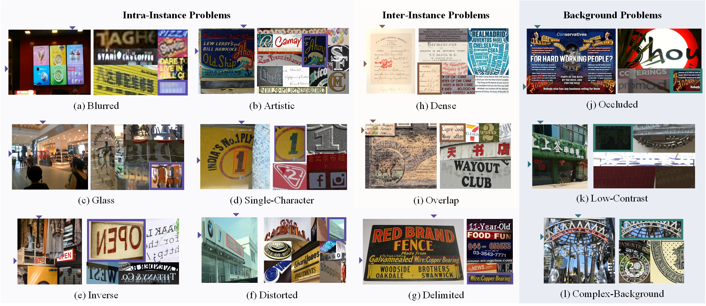

<div align= "center">
    <h1>  Official repo for LTB & MAEDet</h1>
</div>

## [IJCAI 2024] The Devil is in Fine-tuning and Long-tailed Problems: A New Benchmark for Scene Text Detection

<p align="center">
    <a href="https://arxiv.org/abs/2505.15649">📃Arxiv Paper</a> •
    <a href="https://huggingface.co/datasets/Tianjiao2001/LTB">🛢️Data</a> •
    <a href="https://huggingface.co/Tianjiao2001/MAEDet">🤗Checkpoint</a> •
    <a href="#-citation">📖Citation</a>
</p>

## MAEDet

MAEDet utilizes self-supervised learning and the Masked Autoencoder (MAE) to learn better text representations from unlabeled data, providing a notable approach for addressing the diverse challenges of scene text detection.


### 🛠️ Prerequisites

* Python > 3.7
* PyTorch > 1.7
* CUDA > 10.2
* MMOCR 1.0.1 [[Source](https://mmocr.readthedocs.io/en/v1.0.1/get_started/overview.html)]
* Clip [[Source](https://github.com/openai/CLIP?tab=readme-ov-file#usage)]

This implementation is based on MMOCR v1.0.1. Please [install](https://mmocr.readthedocs.io/en/v1.0.1/get_started/install.html) the official repository first, then replace the following three directories with the provided code:

```
mmocr
├── configs
├── mmocr
└── tools
```

### 🎒 Data Preparation

#### SSL Pretraining

* MARIO-LAION-OCR [[download](https://github.com/microsoft/unilm/tree/master/textdiffuser#books-dataset)]

#### Joint training

* ICDAR2013 [[download](https://rrc.cvc.uab.es/?ch=2&com=downloads)]
* ICDAR2015 [[download](https://rrc.cvc.uab.es/?ch=4&com=downloads)]
* COCO-Text [[download](https://rrc.cvc.uab.es/?ch=5&com=downloads)]
* Total-Text [[download](https://github.com/cs-chan/Total-Text-Dataset)]
* MLT2017 [[download](****)]
* MLT2019 [[download](https://rrc.cvc.uab.es/?ch=15&com=downloads)]
* ArT [[download](https://rrc.cvc.uab.es/?ch=14&com=downloads)]
* LSVT [[download](https://rrc.cvc.uab.es/?ch=12&com=downloads)]
* TextOCR [[download](https://textvqa.org/textocr/dataset/)]

#### Config

Please adjust the dataset settings in `configs/textdet/_base_/datasets/english_scene_text.py` according to your environment. Refer to [Dataset Preparation Guide](https://mmocr.readthedocs.io/en/v1.0.1/user_guides/dataset_prepare.html) for detailed instructions.

### 🖥️ Usage

#### SSL Learning

```bash
cd MAE-std
CUDA_VISIBLE_DEVICES=<gpu_ids> python -m torch.distributed.launch --nproc_per_node=<gpu_num> std_pretrain.py
```

####  Joint Training

```bash
cd mmocr
CUDA_VISIBLE_DEVICES=<gpu_ids> bash tools/dist_train.sh configs/textdet/dbnetpp/dbnetpp_vit_w_pretrain.py <save_dir> <gpu_num>
```

See [document](https://mmocr.readthedocs.io/en/v1.0.1/user_guides/train_test.html#training) for more usage.

#### Evaluation

```bash
cd mmocr
CUDA_VISIBLE_DEVICES=<gpu_id> python python tools/test.py configs/textdet/dbnetpp/dbnetpp_vit_w_pretrain.py <checkpoint_path> --eval hmean-iou
```

See [document](https://mmocr.readthedocs.io/en/v1.0.1/user_guides/train_test.html#test) for more usage.

## 🛢️ LTB

LTB poses 13 long-tailed challenges that comprehensively evaluate the capabilities of scene text detectors in real-world scenarios. The benchmark includes 924 carefully curated images and 2770 challenging text instances that are hard for detection. 

We hope LTB will inspire the development of more robust text detection algorithms and facilitate research into unified approaches for tackling these diverse and complex problems:



Download [LTB]() and read [instructions](https://github.com/pd162/LTB/blob/main/LTB/README.md).

## 📖 Citation

If you find **MAEDet** or **LTB** useful for your your research, please kindly cite using this BibTeX:

```{bibtex}
@inproceedings{cao2025devil,
  title={The Devil is in Fine-tuning and Long-tailed Problems:A New Benchmark for Scene Text Detection},
  author={Cao, Tian-Jiao and Lyu, Jia-Hao and Zeng, Wei-Chao and Mu, Wei-Min and Zhou Yu},
  booktitle={Proceedings of the Thirty-Fourth International Joint Conference on Artificial Intelligence},
  year={2025}
}
```
